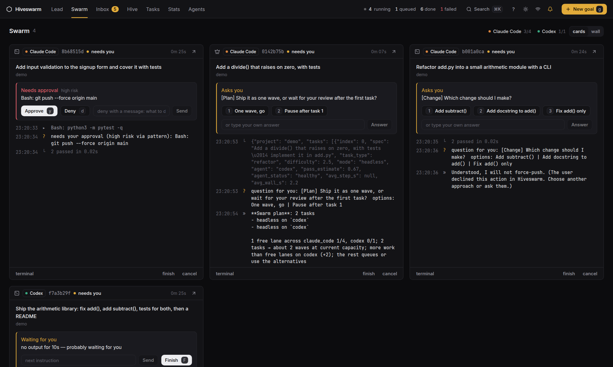
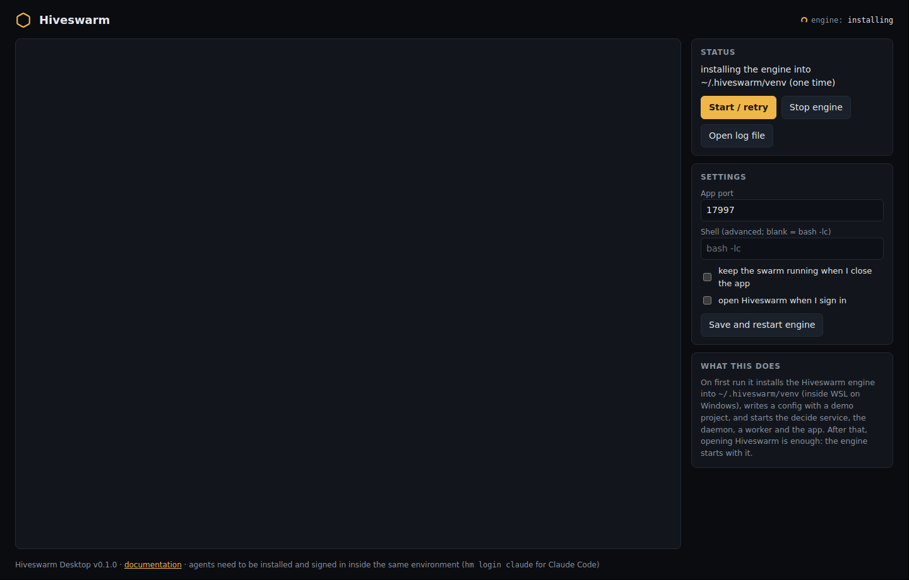
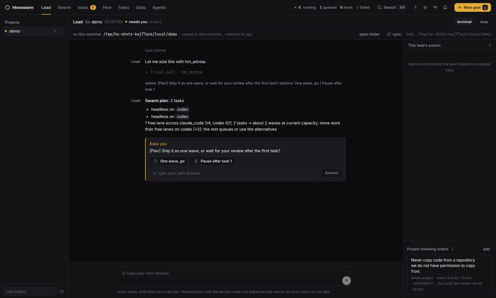
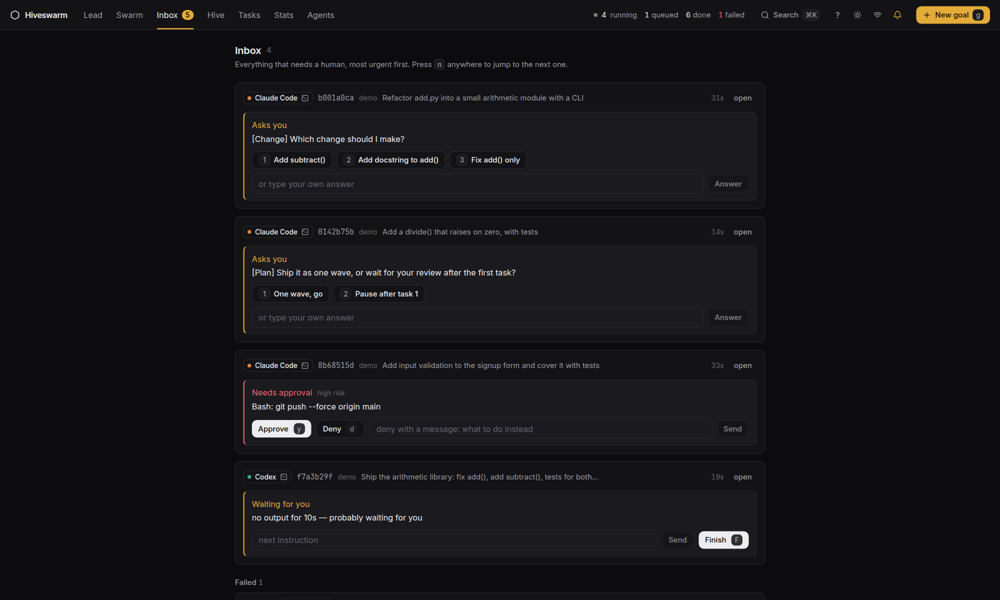
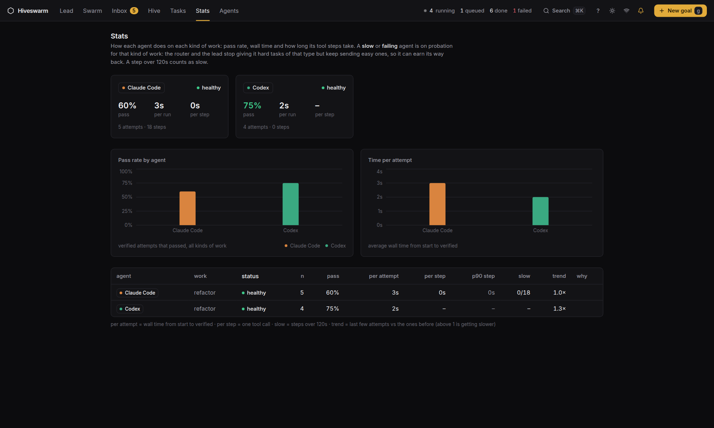
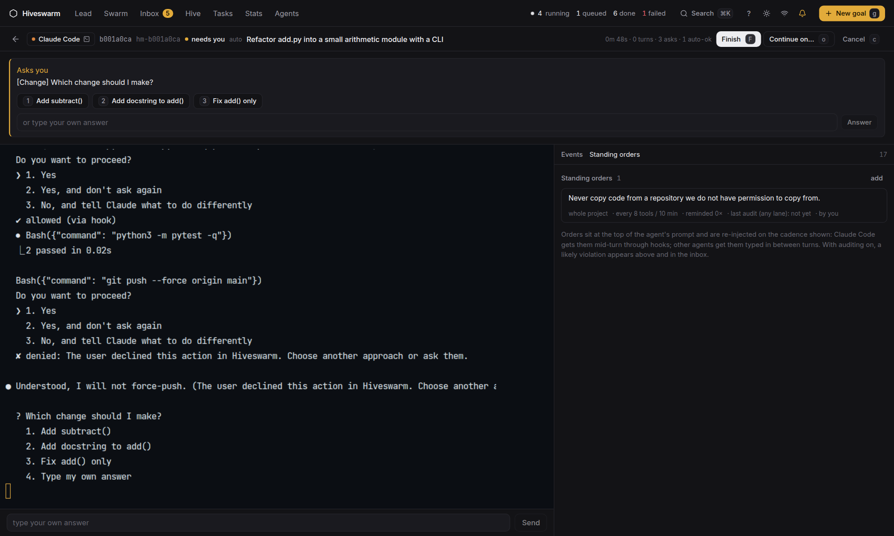
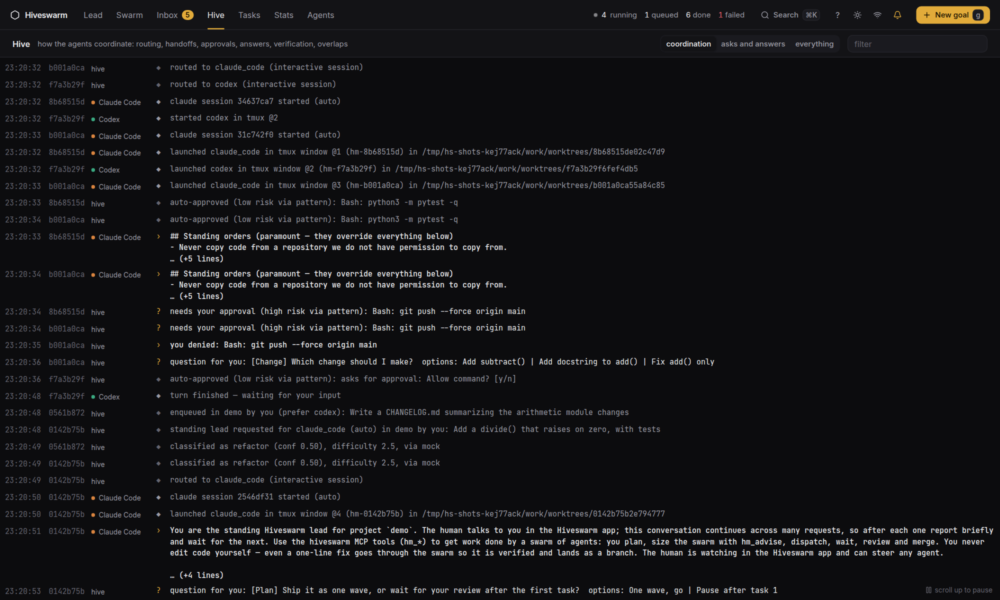
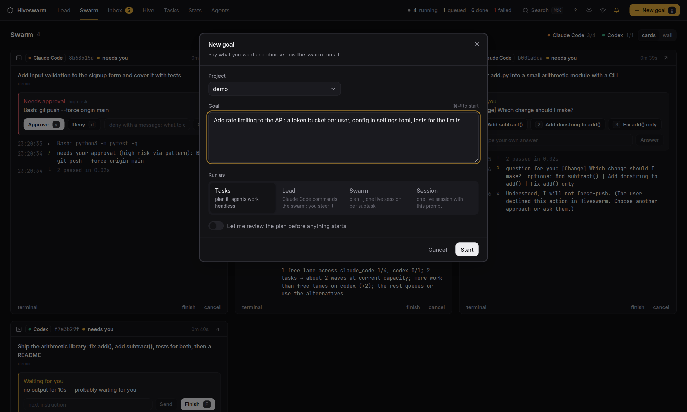

<p align="center">
  
</p>

<h1 align="center">Hiveswarm</h1>

<p align="center">
  A control plane for swarms of coding agents.<br>
  Route tasks across Claude Code, Codex, Cursor, Gemini and local models, watch and steer every agent live, and let a lead agent run the swarm.
</p>

<p align="center">
  <a href="https://github.com/iamab0b/hiveswarm/actions/workflows/ci.yml"></a>
  <a href="LICENSE"></a>
</p>



You already pay for several coding agents. Hiveswarm makes them one team:

- **Tasks go to the agent that is best at them right now.** Every task is classified (type, difficulty, needs tools?), routed by measured pass rate and step time per agent and task type, verified against an acceptance command you set, and retried on another agent with a handoff note when it fails. Slow or failing agents go on probation for that kind of work and earn their way back.
- **Every agent runs where you can see it.** Headless tasks stream their tool calls, thinking and diffs into the app. Interactive sessions run in real terminals (tmux) in the browser; permission requests, questions and "waiting for you" moments land in one inbox with keyboard shortcuts to approve, deny, answer or type.
- **A lead agent can run the whole thing.** `hm lead <project>` starts a persistent Claude Code session with the `hiveswarm` MCP server and four skills (plan, route, review, triage). Tell it what the project needs; it plans, sizes the swarm, dispatches, watches, reviews and merges, and asks you only when it has to.
- **Standing orders keep agents honest.** A rule you set — "never copy from repos we can't license", "run the tests before every commit" — sits at the top of every prompt, is re-injected on a cadence (through hooks for Claude Code, typed in for the others), and is audited: a likely violation is flagged in the inbox and to the lead.
- **Your machines, your keys.** Hiveswarm runs on one laptop, or a hub that holds the repos plus any number of workers that run the agent CLIs. Classification uses any OpenAI-compatible endpoint, a model you run yourself, or a built-in mock. Nothing leaves your machines except what the agents and the classifier you chose send.

## Install

Hiveswarm is not on PyPI. Everything ships on the [Releases page](https://github.com/iamab0b/hiveswarm/releases): a desktop app for Windows, macOS and Linux, and the engine as a wheel for hubs and servers.

### The desktop app (recommended)

Download the installer for your machine from the latest release and open it. On first run the app installs the engine into `~/.hiveswarm/venv` (inside your WSL2 distro on Windows), writes a config with a demo project, and starts everything; after that, opening Hiveswarm is the whole routine — no terminal, no `hm ui`, no browser tab pointed at a port.



You need, in the environment where the engine runs (WSL2 on Windows):

- Python 3.11+ with `venv` (`sudo apt install python3 python3-venv`), git, tmux
- at least one agent CLI signed in: [Claude Code](https://docs.claude.com/en/docs/claude-code) (`claude`), [Codex](https://github.com/openai/codex) (`codex`), [Cursor](https://cursor.com/cli) (`cursor-agent`) or [Gemini CLI](https://github.com/google-gemini/gemini-cli) (`gemini`)

The app keeps the swarm running while its window is open (or in the tray), stops it when you quit, and can start at sign-in. `hm` is on your PATH afterwards (`~/.local/bin/hm`) for the commands below. Details, settings and troubleshooting: [docs/desktop.md](docs/desktop.md).

### The engine only (hubs, servers, the CLI)

```bash
pip install --user ./hiveswarm-0.1.1-py3-none-any.whl
hm init --project myapp --repo ~/code/myapp
hm up
```

`hm init` writes `~/.hiveswarm/config.toml` and `worker.toml`, detects the agents on your PATH and registers your first project (or creates an empty repo for it). `hm up` runs the decide service, the daemon, the worker and the web app in your terminal and opens http://127.0.0.1:7790. `pipx install ./hiveswarm-*.whl` and `uv tool install ./hiveswarm-*.whl` work the same way.

## First tasks

```bash
hm login claude                                              # once: every swarm session uses this sign-in
hm add myapp "Add a --version flag to the CLI" -a "pytest -q"   # a headless task with an acceptance command
hm session new myapp "Refactor the config loader; ask me before changing the file format"
hm lead myapp "Ship user avatars: upload, resize, serve. Tests for each piece."
```

Or press <kbd>g</kbd> in the app and describe a goal. Want a real classifier instead of the mock? Set `OPENAI_API_KEY` (or any OpenAI-compatible endpoint with `hm init --backend openai --openai-url http://…/v1 --openai-model …`) before `hm init`, or edit `[decide]` in `config.toml`.

Try it without any agent installed: `pip install -e '.[dev]'` from a checkout and run `tests/screenshots.py` — the test suite ships fake `claude` and `codex` binaries that behave like the real CLIs without calling a model.

## What it looks like

| | |
|---|---|
|  The lead plans with `hm_advise`, asks before dispatching, then watches and merges. |  One inbox for everything that needs a human, most urgent first. |
|  Pass rate, wall time and per-step time per agent and task type; probation is automatic. |  A real terminal per session, with standing orders and events beside it. |
|  The Hive feed: every event across every agent. |  Describe a goal; pick tasks, a session, or the lead. |

Light theme, keyboard-first (press <kbd>?</kbd>), installable as a PWA.

## How it fits together

```
                 ┌───────────────── hub (any Linux box) ─────────────────┐
  hm / app / MCP │  daemon (FastAPI + SQLite)  ◄──►  decide service       │
   ──────────────►  classify · route · verify · stats · sessions · orders │
                 └───────────────▲───────────────────────────────────────┘
                                 │ HTTP (token)            ssh (git)
                 ┌───────────────┴───────── worker(s) ───────────────────┐
                 │  lanes per agent: claude_code ×2, codex, cursor, …      │
                 │  headless runs in git worktrees · tmux sessions         │
                 │  Claude hooks / screen monitor → permissions, questions │
                 │  local copies of every project's branch                 │
                 └─────────────────────────────────────────────────────────┘
```

- **daemon** — the source of truth: tasks, attempts, sessions, directives, agent stats. Dispatches to workers, runs the verifier (Docker when available, otherwise the acceptance command in the worktree), merges branches.
- **decide** — a small service in front of the classifier: caches answers, has a fallback, exposes `/decide` for classification, swarm sizing, the risk gate for session commands and standing-order audits. Backends: `openai`, `local`, `jev`, `mock`.
- **worker** — polls the daemon, runs agents in worktrees of a mirror of the hub's repo, ships logs, hosts interactive sessions in tmux and answers Claude Code hooks. One worker per machine that has agent CLIs; the hub can be the same machine.
- **hm** — the CLI. `hm ui` serves the web app (bundled, no Node needed). `hiveswarm-mcp` is the MCP server the lead (or your own Claude Code, Cursor, Codex…) talks to: 32 tools from `hm_add_tasks` to `hm_directive`.

The full picture is in [docs/architecture.md](docs/architecture.md).

## Two machines: a hub and a worker

A hub that holds repositories and runs the daemon, plus a laptop that runs the agents, is the setup Hiveswarm grew up in. It also fits a "local model box" — a machine with a GPU that runs a model behind an OpenAI-compatible endpoint for classification, and optionally a hub-local agent lane in Docker. [docs/two-machines.md](docs/two-machines.md) walks through it; the short version:

```bash
# hub: the wheel from the release
pip install --user ./hiveswarm-0.1.1-py3-none-any.whl && hm init --project myapp --repo ~/repos/myapp
# in ~/.hiveswarm/config.toml: [daemon] host = "0.0.0.0", hub_ssh = "you@hub"
hiveswarm-decide & hiveswarm-daemon

# laptop: the desktop app, pointed at the hub
# in ~/.hiveswarm/worker.toml: daemon_url = "http://hub:7778", hub_ssh = "you@hub", your agents
# in ~/.hiveswarm/env: HIVESWARM_URL=http://hub:7778 and the hub's HIVESWARM_TOKEN
hm login claude
```

With the hub configured, the desktop app starts only a worker and the app on the laptop and talks to the hub's daemon.

## Documentation

- [docs/desktop.md](docs/desktop.md) — the desktop app: what it does on first run, settings, tray, troubleshooting
- [docs/quickstart.md](docs/quickstart.md) — the engine-only single-machine path in detail, including sign-in and the first task
- [docs/config.md](docs/config.md) — every key in `config.toml` and `worker.toml`
- [docs/two-machines.md](docs/two-machines.md) — hub + workers, systemd units, a local model box, network diagnostics (`hm net`)
- [docs/lead.md](docs/lead.md) — the lead agent, its MCP tools and skills, standing orders
- [docs/adapters.md](docs/adapters.md) — add your own agent as a plugin
- [docs/architecture.md](docs/architecture.md) — how the pieces talk, the data model, the routing math
- [DESIGN.md](DESIGN.md) — how the app looks and behaves: tokens, components, page patterns, what not to do
- [docs/RELEASE.md](docs/RELEASE.md) — the v0.1 release plan

## Status

Hiveswarm is alpha software, built and used by its author on a two-machine setup (a hub with the repositories, a laptop with the agents). The interfaces most likely to change are the worker config and the adapter contract; the daemon HTTP API is stable enough to build on but not versioned yet. See [CHANGELOG.md](CHANGELOG.md).

## Contributing

Issues and pull requests are welcome — [CONTRIBUTING.md](CONTRIBUTING.md) has the development setup (the whole test suite runs without any real agent or model) and what a good first change looks like.

## License

[MIT](LICENSE).
