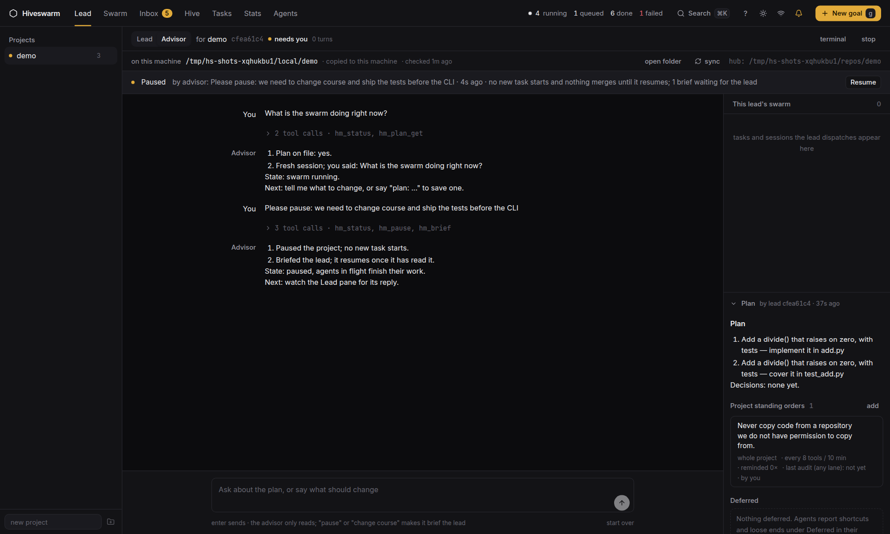

# The advisor

The lead runs the swarm; the **advisor** is who you talk to about it. It sits beside the lead on the Lead page (the *Advisor* switch), reads everything the lead can read, keeps the project's **plan** on file, and never dispatches or merges. Talking to it costs the lead nothing: no interruption, no lost turn.

## What it can do

The advisor is Claude Code run headless (`claude -p … --resume`) on a worker that has it, with the hiveswarm MCP server in its **advisor role** (`HIVESWARM_ROLE=advisor`): the read-only tools (`hm_status`, `hm_list`, `hm_get`, `hm_tail`, `hm_feed`, `hm_diff`, `hm_stats`, `hm_agents`, `hm_inbox`, `hm_sessions`, `hm_screen`, `hm_deferred`, `hm_directives`) plus five of its own:

| tool | what it does |
|---|---|
| `hm_plan_get(project)` | the plan on file and whether the project is paused |
| `hm_plan(project, text)` | save the plan (markdown); the lead saves it after planning, the advisor when you change it |
| `hm_pause(project, reason)` | no new task or session of the project starts and nothing merges until resumed; agents already working finish |
| `hm_resume(project)` | lift the pause |
| `hm_brief(project, text)` | hand the lead an update |

Its conversation persists per project (the Claude session is resumed turn after turn); *start over* under the composer drops it. The plan stays.

## Discussing versus changing course

Asking questions, weighing options and editing the plan are *discussing*: the advisor answers from the tools and updates the plan with `hm_plan` when you agree on a change. The lead is not involved.

When you want the swarm to do something different from what it is doing, the advisor **changes course**:

1. `hm_pause(project, reason)`: the dispatcher stops routing the project's tasks, `hm_merge` and the merge button refuse, running agents finish what they are on.
2. It looks at what is in flight and what waits on whom.
3. `hm_brief(project, text)`: five short sections. *What happened. What is in flight. Waiting on. The human's update. How to proceed.*
4. The lead receives the brief: `hm_wait` returns it under `briefs` (and interrupts the wait), and when the lead's terminal is idle the brief is also typed into it. A lead that starts or reopens later gets undelivered briefs in its prompt. The lead's skill tells it to read the brief, adjust the plan and the swarm, say in two lines what changed, and `hm_resume(project)`.

The Lead page shows the pause as a banner with a *Resume* button, so you can lift it yourself; `hm resume` is not needed, the daemon API is `POST /projects/<name>/resume`.

## Style

The advisor answers in the i-have-adhd style ([ayghri/i-have-adhd](https://github.com/ayghri/i-have-adhd), MIT): the next action first, numbered steps, the swarm's state restated in one line, specific minutes when it estimates, wins visible, errors matter-of-fact, lists capped at five, one concrete next step at the end, no preamble, no recap, no closers. The rules are in `hiveswarm.advisor.ADVISOR_STYLE` and go into every turn's system prompt. The lead's own replies keep their shape; if you want the same terseness there, say so in your first message to it.

## API

`GET /advisor/<project>` (state and messages), `POST /advisor/<project>/talk {text}`, `DELETE /advisor/<project>` (start over); `GET/PUT /projects/<project>/plan`; `POST /projects/<project>/pause {by, reason}`, `POST /projects/<project>/resume`; `GET/POST /projects/<project>/briefs`, `POST /briefs/<id>/delivered`. Workers receive advisor turns through the same long-polled `GET /sessions/commands` they use for session commands (`advisor_ok=true`), one turn per project at a time.
