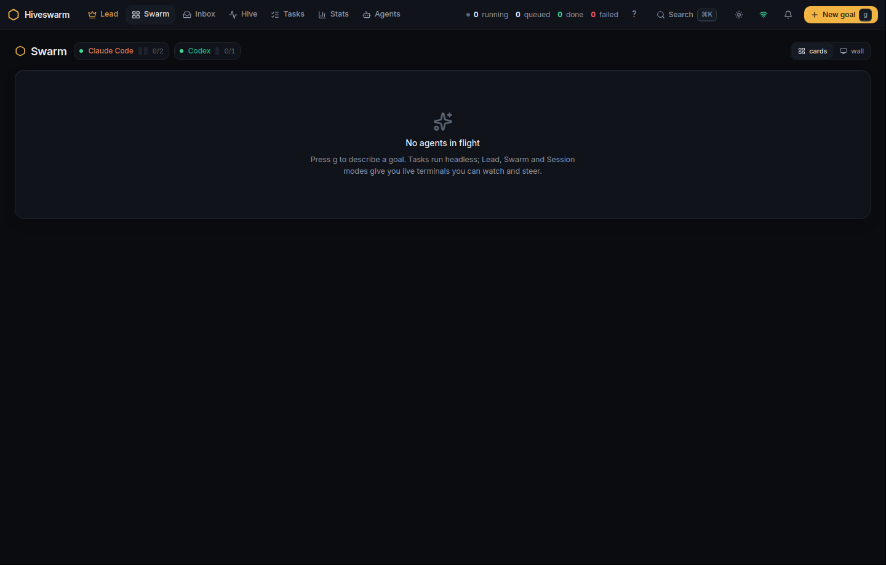

# Hiveswarm Desktop

The desktop app is Hiveswarm in its own window. It starts the engine for you, keeps it running while the app is open (or sits in the tray), and stops it when you quit. There is nothing to type and no browser tab to keep open.



## Install

Download from the [Releases page](https://github.com/iamab0b/hiveswarm/releases):

| platform | file | notes |
|---|---|---|
| Windows 10/11 | `Hiveswarm-<version>-win-x64.exe` | the installer; a portable `.exe` is there too. The engine runs inside WSL2. |
| macOS | `Hiveswarm-<version>-mac-arm64.dmg` / `-x64.dmg` | unsigned: the first time, right-click the app → Open |
| Linux | `Hiveswarm-<version>-linux-x86_64.AppImage` or `.deb` | `chmod +x` the AppImage |

Inside the environment where the engine runs (your WSL2 distro on Windows, the machine itself elsewhere) you need Python 3.11+ with `venv`, git and tmux, and the agent CLIs you want to use, signed in:

```bash
sudo apt update && sudo apt install -y python3 python3-venv git tmux
```

## First run

The boot screen shows what the app is doing and its log:


1. **Checking** — it runs a login shell (through `wsl.exe` on Windows) and looks for `hm`.
2. **Installing** — when there is none, or an older version than the app ships, it creates `~/.hiveswarm/venv`, installs the bundled wheel into it, and links `hm`, `hiveswarm-worker`, `hiveswarm-mcp`, `hiveswarm-daemon` and `hiveswarm-decide` into `~/.local/bin`. About a minute.
3. **Initialising** — when there is no `~/.hiveswarm/config.toml`, it runs `hm init --project demo`, which detects your agents and creates a demo repository.
4. **Starting** — `hm up --no-open` starts the decide service, the daemon, a worker and the app server on `127.0.0.1:7790`; the window switches to the app as soon as it answers.

Every later launch skips to step 4, or to nothing at all if the engine is already running (for example under systemd, or left running by "keep the swarm running when I close the app").

Then, once, in a terminal in the same environment: `hm login claude` so sessions never stop at Claude's sign-in screen.

## Settings

Open the boot screen from the tray menu ("Restart engine" shows it) or when the engine fails.

| setting | meaning |
|---|---|
| WSL distro / user (Windows) | which distro runs the engine; blank means the default distro and its default user |
| App port | where the app listens on `127.0.0.1` (default 7790) |
| Shell | the login shell the engine commands run in; default `bash -lc`. The app prepends `~/.hiveswarm/venv/bin`, `~/.local/bin`, `~/.bun/bin`, `~/.cargo/bin` to `PATH` and sources nvm, so agents installed with npm through nvm are found |
| keep the swarm running when I close the app | quit leaves `hm up` running; the next launch attaches to it |
| open Hiveswarm when I sign in | registers the app as a login item |

Settings live in the app's user-data folder (`%APPDATA%\Hiveswarm\settings.json` on Windows, `~/.config/Hiveswarm/settings.json` on Linux, `~/Library/Application Support/Hiveswarm/settings.json` on macOS), next to `logs/engine.log`.

## The tray

Closing the window hides the app in the tray (macOS: the Dock) and keeps the swarm running. The tray menu has Open, Restart engine, Stop engine, Engine log, and two ways to quit: **Quit and stop the swarm** or **Quit, keep the swarm running**.

## With a hub

The app runs whatever `hm up` runs. On a laptop that talks to a hub, put `daemon_url` and `hub_ssh` in `~/.hiveswarm/worker.toml` and the hub's URL and token in `~/.hiveswarm/env` (see [two-machines.md](two-machines.md)); `hm up` then starts only a worker and the app locally. A hub with no desktop uses the wheel from the same release and the systemd units in `deploy/systemd/`.

## Troubleshooting

- **"WSL is not installed"** — from an admin PowerShell: `wsl --install`, reboot, open the distro once to create your user.
- **"Python 3.11+ is missing" / "python3-venv is missing"** — run the `apt install` line above inside WSL and press *Start / retry*.
- **The engine starts but the app says no agents** — the CLIs are not on the engine's PATH. Check with `hm agents` in a WSL terminal; if they are installed through nvm, make sure `~/.nvm/nvm.sh` exists, or put their directory in the Shell setting as `bash -lic` (interactive, loads your full `.bashrc`).
- **Port already in use** — change *App port* and save; the app restarts the engine on the new port.
- **Stuck at "starting"** — open the engine log (button on the boot screen); the usual causes are a wrong daemon URL/token in `~/.hiveswarm/env` for a hub setup, or a firewall between the laptop and the hub. `hm net` in a terminal shows what the worker and the app could and could not reach.
- **The app is up but shows the old version after an update** — quit with *Quit and stop the swarm* and reopen; the new app upgrades the engine on start.

## Building it yourself

```bash
pip install build && python -m build --wheel        # ../dist/hiveswarm-<version>-py3-none-any.whl
cd desktop && npm ci && npm run dist:linux           # or dist:win / dist:mac
```

The release workflow (`.github/workflows/release.yml`) does the same on GitHub's Windows, macOS and Linux runners for every `v*` tag and attaches the installers, the wheel and a `SHA256SUMS.txt` to the release.
